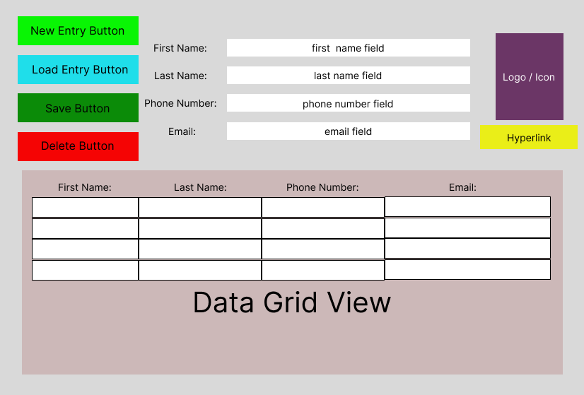
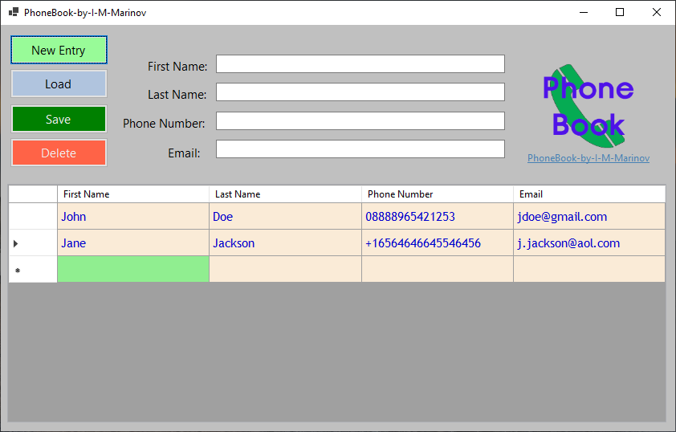
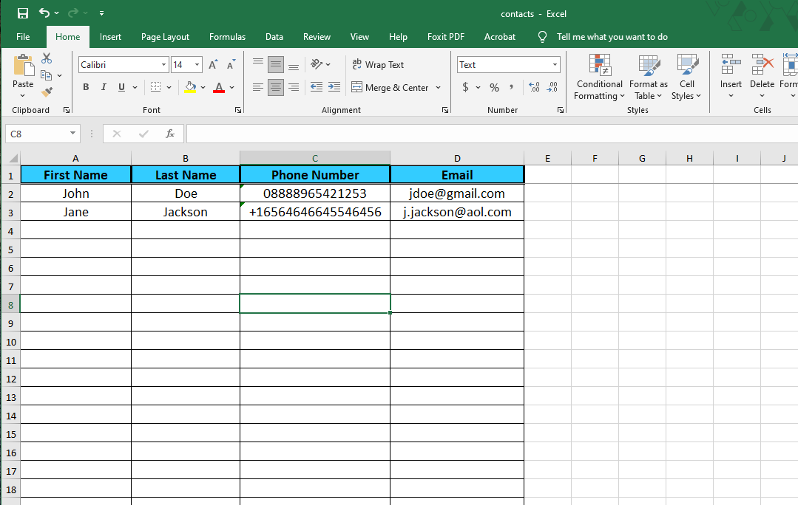

# Phone-Book-by-I-M-Marinov

## Description:

- Simple UI Windows application for saving your contacts 

## Technology stack:
- C#
- .NET Core
- Photoshop CS6 ( for the icon )
- EPPlus Software's OfficeOpenXml 7.1.0 nuget ( Spreadsheet library for .NET Core and .NET Framework - free version, non-commercial use )
- Figma
- Microsoft Excel
  

## Design Diagram:

## Features
//TO BE UPDATED:

## Screenshots: 

## Planned updates:

- Search
- Data validation for the phone number field
  

 
