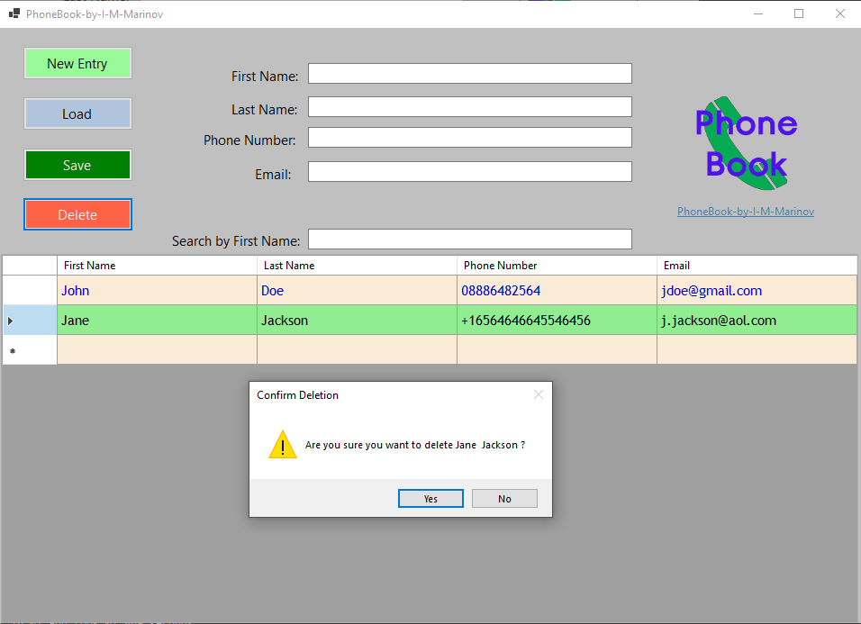
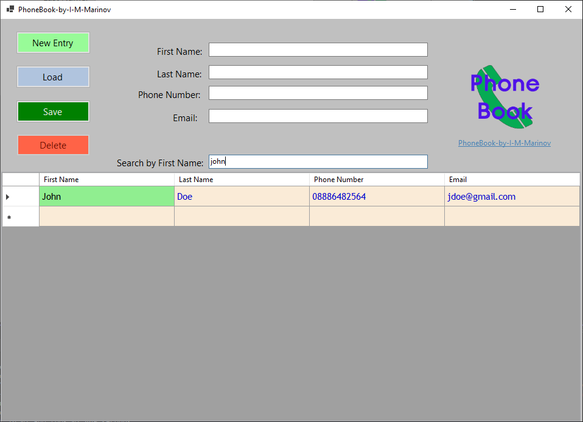
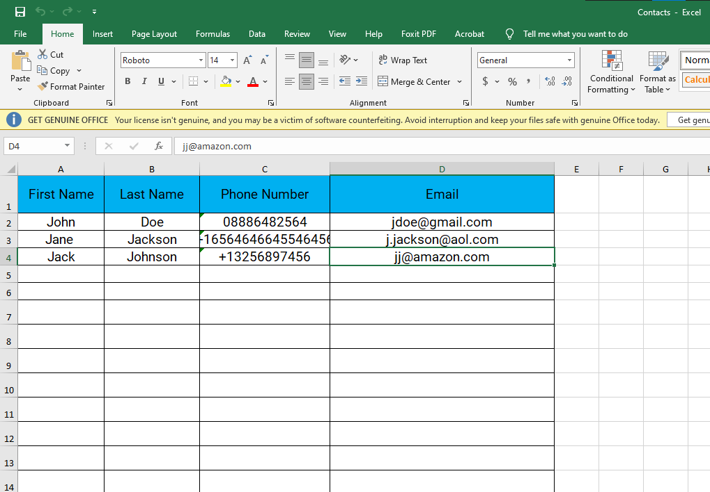

# Phone-Book-by-I-M-Marinov

## Description:

- Simple UI Windows application for saving your contacts 

## Technology stack:
- C#
- .NET Core
- Photoshop CS6 ( for the icon )
- EPPlus Software's OfficeOpenXml 7.1.0 nuget ( Spreadsheet library for .NET Core and .NET Framework - free version, non-commercial use )
- Figma
- Microsoft Office Excel
  

## Original Design Diagram:

## Features
- New Entry feature - adds a new empty ( First name, Last name, Phone number and Email to the database ( Excel document )
- Load - Loads an entry when it is marked on in the DataGrid View on the bottom of the application
- Save - Saves an entry in the database. Contacts are going to be saved if all the information is put in ( cannot save incomplete contacts ).
- Delete - Deletes an entry from the DataGrid View in the application and in the database ( Excel spreadsheet ).
- Adjustable file path for the Contacts Excel file. Just go in and change the string **excelFilePath = @"C:\Users\Marinov\Desktop\contacts.xlsx"**

## Updates
- Program now checks for duplicate contacts ( only by First and Last Name, so it let's the user add a second number or email for instance for the same person under a different name )
- The delete button would no longer delete immediately a contact. Extra validation added, so the user can avoid accidently deleting contacts from the list.
- Search ----> You can search by First Name in the application. While searching you cannot delete a contact ( delete button is disabled ).
  

 

 

## Screenshots: 

## Planned updates:

- Implement a way for the user to choose where the "Contacts" spreadsheet is saved 
- Data validation for the phone number field
- Data validation for the email field
  

 
