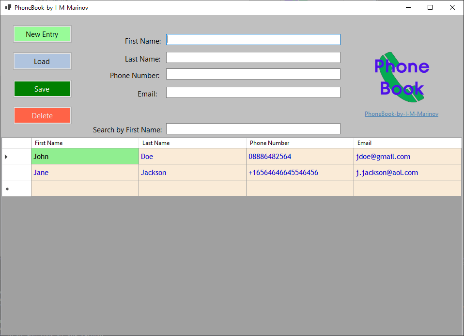

# Phone-Book-by-I-M-Marinov

## Description:

- Simple UI Windows application for saving your contacts 

## Technology stack:
- C#
- .NET Core
- Photoshop CS6 ( for the icon )
- EPPlus Software's OfficeOpenXml 7.1.0 nuget ( Spreadsheet library for .NET Core and .NET Framework - free version, non-commercial use )
- Figma
- Microsoft Office Excel
  

## Original Design Diagram:

## Features
- New Entry feature - adds a new empty ( First name, Last name, Phone number and Email to the database ( Excel document )
- Load - Loads an entry when it is marked on in the DataGrid View on the bottom of the application
- Save - Saves an entry in the database. Contacts are going to be saved if all the information is put in ( cannot save incomplete contacts ).
- Delete - Deletes an entry from the DataGrid View in the application and in the database ( Excel spreadsheet ).
- Adjustable file path for the "Contacts" Excel file. If you choose a new path, the application would move the ooriginal file to the new directory. 

## Updates
- Program now checks for duplicate contacts ( only by First and Last Name, so it let's the user add a second number or email for instance for the same person under a different name )
- The delete button would no longer delete immediately a contact. Extra validation added, so the user can avoid accidently deleting contacts from the list.
- Search ----> You can search by First Name in the application. While searching you cannot delete a contact ( delete button is disabled ).
- The application comes with a default file path for the Contacts spreadsheet, but if you would like to change it you can do so when saving a new contact. The application will now ask for confirmation to save the information that was added in the app on the spreadsheet as well ( Save and Delete ).
- File Path for the application is now added to Options on the project. If you want to change the Excel path, it would simply get the file from it's last known directory and move it to the new one ( in opposition to actually creating a new file like before ). 

  

 

 

## Screenshots: 

## Planned updates:

- Data validation for the phone number field
- Data validation for the email field
  

 
